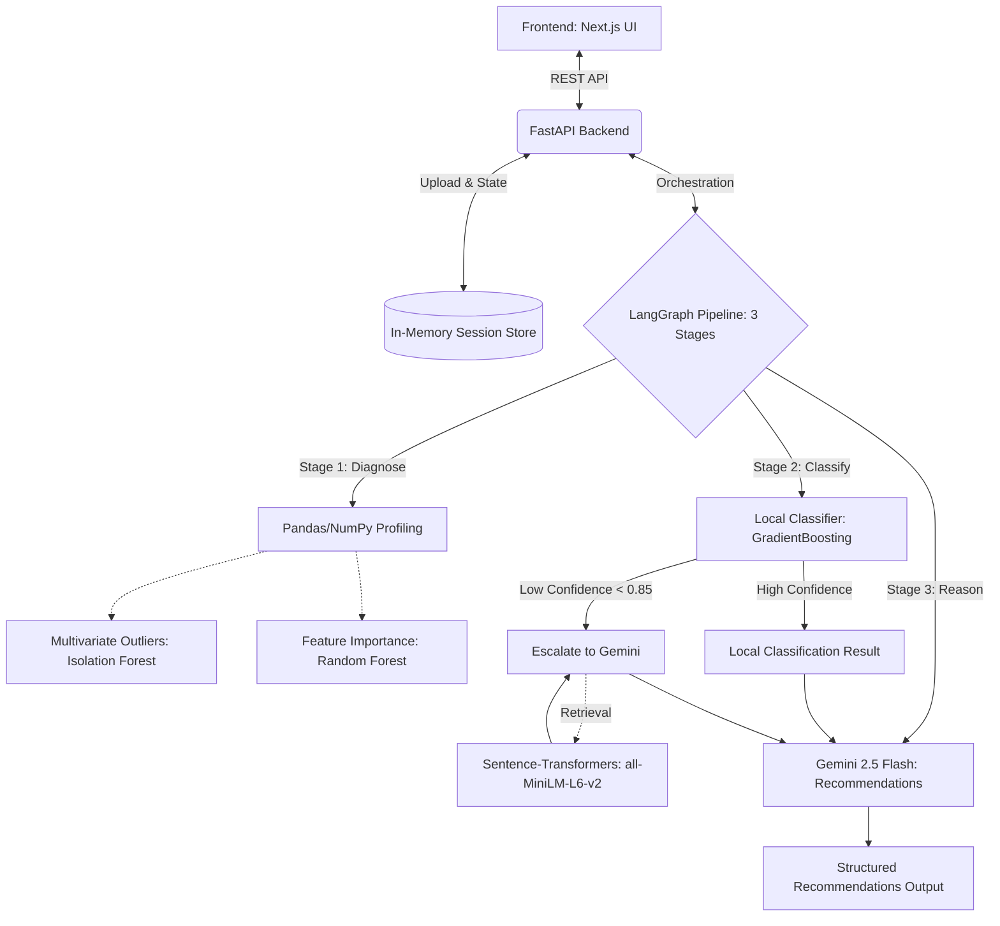

# DataRx AI

DataRx AI is an automated data diagnostic and cleaning tool designed as a "diagnostic clinic" for messy tabular data. It goes beyond static, rule-based ETL profiling by adding a semantic reasoning layer that understands what each column represents and recommends tailored fixes case-by-case.

[](https://fastapi.tiangolo.com/)
[](https://nextjs.org/)
[](https://www.python.org/)
[](https://opensource.org/licenses/MIT)
[](#)

> **Quick Start:** Upload your messy dataset, let AI diagnose the issues, preview the recommended fixes, and export the cleaned data.

## Table of Contents
- [The Problem](#the-problem)
- [Features](#features)
- [Architecture](#architecture)
- [Why This Isn't Just Rule-Based ETL](#why-this-isnt-just-rule-based-etl)
- [Tech Stack](#tech-stack)
- [Getting Started](#getting-started)
- [How It Works — Step by Step](#how-it-works--step-by-step)
- [Model Details](#model-details)
- [API Reference](#api-reference)
- [Known Limitations](#known-limitations)
- [Roadmap](#roadmap)
- [Contributing](#contributing)
- [FAQ](#faq)
- [License](#license)
- [Acknowledgements](#acknowledgements)

## The Problem
Traditional data cleaning tools rely on fixed rules (e.g., "if missing > 50%, drop column"). However, context matters: a 50% missing rate on an optional "middle_name" column is normal, but a 10% missing rate on "order_id" is a critical error. DataRx AI solves this by introducing a semantic reasoning layer that understands the context of your data to provide accurate, grounded remediation recommendations.

## Features
- **Semantic Type Classification:** Identifies what your data actually represents (e.g., `currency`, `zip_code`, `email`, `percentage`, etc.), not just its underlying system data type.
- **Hybrid AI/ML Architecture:** Uses a lightning-fast local Gradient Boosting classifier for obvious columns and selectively escalates ambiguous columns to an LLM (Gemini 2.5 Flash).
- **Target-Aware Analysis:** Detects target leakage and evaluates feature importance using a Random Forest model if you specify a target column.
- **Context-Aware Recommendations:** Suggests appropriate fixes (e.g., `impute_median`, `merge_categories`, `log_transform`) based on the semantic type, correlation, and statistical distribution.
- **Multivariate Outlier Detection:** Employs an Isolation Forest to catch combinations of data points that are unusual together, even if they look normal individually.
- **Interactive UI:** Provides a sleek Next.js interface with before-and-after statistics to review and apply recommendations.

## Architecture



## Why This Isn't Just Rule-Based ETL
In typical ETL workflows, data cleaning is driven by hardcoded thresholds. DataRx AI replaces this rigidity with schema-constrained, LLM-powered reasoning. 
Instead of applying a single fixed rule to every column (like filling all missing numerics with the median), DataRx uses a combination of offline ML and few-shot retrieved examples to understand a column's semantic type. It will suggest imputing missing values for a `numeric_continuous` column like "age", but it will correctly advise dropping the rows if the column is identified as a critical `id`.

## Tech Stack
| Component | Technology | Use Case |
| :--- | :--- | :--- |
| **Frontend** | Next.js, React, TypeScript, Tailwind CSS | Sleek, interactive UI with step-by-step flows |
| **Backend** | FastAPI (Python) | High-performance REST API, fully stateless session store |
| **Orchestration** | LangGraph, LangChain | Managing the 3-stage pipeline (Diagnose -> Classify -> Reason) |
| **AI / LLM** | Google Gemini (gemini-2.5-flash) | Semantic classification and reasoning layer |
| **ML Profiling** | scikit-learn, pandas, numpy, scipy | Dtype inference, outlier detection, and local classification |
| **Embeddings** | sentence-transformers | Few-shot dynamic retrieval (all-MiniLM-L6-v2) |

## Getting Started

### Prerequisites
- Node.js 18+ and npm
- Python 3.11+

### Installation
1. **Clone the repository**
   ```bash
   git clone https://github.com/your-username/datarx-ai.git
   cd datarx-ai
   ```

2. **Set up the Backend**
   ```bash
   cd backend
   python -m venv .venv
   source .venv/bin/activate  # On Windows: .venv\Scripts\activate
   pip install -r requirements.txt
   ```

3. **Configure Environment Variables**
   Create a `.env` file in the `backend/` directory:
   ```env
   GOOGLE_API_KEY=your_gemini_api_key
   LANGCHAIN_API_KEY=your_langsmith_api_key
   LANGCHAIN_TRACING_V2=true
   LANGCHAIN_PROJECT=datarx_ai
   ```

4. **Run the Backend (Port 8000)**
   ```bash
   uvicorn app.main:app --host 0.0.0.0 --port 8000 --reload
   ```

5. **Set up and Run the Frontend (Port 3000)**
   Open a new terminal window:
   ```bash
   cd frontend
   npm install
   npm run dev
   ```
   Access the app at `http://localhost:3000`.

## How It Works — Step by Step
1. **Upload:** You upload a messy tabular dataset (`.csv`). The backend assigns it a unique session ID.
2. **Diagnose:** The system calculates basic stats (missing %, cardinality, correlations, and multivariate outliers).
3. **Classify:** The local model rapidly predicts the semantic type of each column. Any low-confidence columns are dynamically escalated to Gemini, equipped with few-shot examples fetched via a sentence transformer.
4. **Recommend:** Gemini generates specific fixes tied to a strictly constrained enum of operations (e.g., `impute_median`, `clip_outliers`).
5. **Apply:** You review the recommendations in the UI, check the before/after stats diff, and click "Apply". The backend executes the Pandas operations in memory and re-syncs the global diagnosis state.
6. **Review & Export:** Before exporting, you are presented with a final **Cleaning Summary Report** that logs every action taken, highlights before/after statistics, and tracks any skipped issues. Once satisfied, you can instantly download the cleansed `.csv`.

## Model Details

> [!IMPORTANT]
> The performance metrics cited internally were calculated on a small, hackathon-scale dataset. These figures demonstrate the capability and architecture of the tool but have not undergone rigorous production-scale validation.

- **Semantic Classifier:** An offline scikit-learn `GradientBoostingClassifier` trained on a mix of synthetic data and weak-labels. 
- **Confidence Calibration vs. Routing:** The model uses Platt scaling (via `CalibratedClassifierCV`) to provide trustworthy confidence scores for reporting purposes. However, because the calibration heavily compresses scores into a narrow band (destroying discriminative power on our small dataset), the system intentionally uses the **raw**, uncalibrated output probability to determine if a column needs escalation to Gemini (using a threshold of `0.85`).
- **Isolation Forest:** Used for multivariate outlier detection. This model is dataset-specific; it is fit fresh on the uploaded dataset and discarded immediately after use.
- **Random Forest Feature Importance:** Used to detect feature leakage against a target column. Like the Isolation Forest, it is fit fresh and discarded. It only runs if the user explicitly selects a target column.

## API Reference

### `POST /upload`
Uploads a CSV file and initializes an in-memory session.
**Response:**
```json
{
  "session_id": "abc-123",
  "diagnosis": {
    "dtypes": [{"column": "age", "inferred_type": "Numerical", "unique_ratio": 0.05, "unique_count": 50}],
    "missingness": [{"column": "age", "missing_pct": 5.2, "missing_count": 104}],
    "outliers": [],
    "correlated_pairs": []
  }
}
```

### `POST /analyze`
Triggers the LangGraph orchestration pipeline to classify and generate recommendations.
**Request:** `{"session_id": "abc-123", "target_column": "revenue"}`
**Response:**
```json
{
  "semantic_types": [{"column": "age", "semantic_type": "numeric_continuous", "is_identifier": false, "notes": "local_model"}],
  "recommendations": [{
    "column": "age",
    "issue": "Missing values detected (5.2%)",
    "severity": "medium",
    "recommended_action": "impute_median",
    "justification": "Age is a continuous numerical feature; median imputation is robust to outliers.",
    "confidence": 0.95,
    "needs_review": false
  }],
  "target_analysis": null
}
```

### `POST /apply-action`
Executes a cleaning action and returns the updated column and dataset statistics.
**Request:** `{"session_id": "abc-123", "column": "age", "action": "impute_median"}`
**Response:**
```json
{
  "success": true,
  "column": "age",
  "action": "impute_median",
  "before": {"missing_pct": 5.2, "mean": 42.5},
  "after": {"missing_pct": 0.0, "mean": 42.1},
  "full_diagnosis": { ... updated full diagnosis ... }
}
```

### `GET /export/{session_id}`
Streams the cleaned dataset as a CSV attachment.

## Known Limitations
<details>
<summary>Click to view limitations</summary>

- **No Persistent Storage:** Sessions are held entirely in-memory and are lost upon backend restart. The tool is deliberately stateless and session-scoped.
- **Calibration Compression:** The confidence calibration on the local semantic classifier is somewhat coarse due to the small size of the training dataset.
- **Merge Categories Simplicity:** The `merge_categories` action implements basic case-normalization and whitespace stripping. It does not perform advanced fuzzy-matching or semantic clustering.
- **Target Selection Requirement:** The Feature Importance module requires manual target selection to operate; it does not automatically hunt for a target.
</details>

## Roadmap
> Note: The following items are ideas for future exploration, not firm commitments.

- Support for Parquet and Excel file uploads.
- Full persistent storage via PostgreSQL for saving cleaning recipes.
- Expanding the LLM reasoning to generate raw Python code snippets for advanced edge-case transformations.

## Contributing
Contributions are welcome! Please open an issue first to discuss what you would like to change. 

## FAQ

<details>
<summary>Why use a hybrid model instead of sending everything to the LLM?</summary>
Sending every column to the LLM is slow and costly. The local classifier handles obvious columns (e.g., zip codes, standard prices) instantly, reserving the LLM's slower, expensive reasoning capabilities for truly ambiguous or messy columns.
</details>

<details>
<summary>Is my data stored permanently?</summary>
No. DataRx AI holds your dataset in-memory temporarily during your session. Once the backend server restarts or you close the session, the data is entirely discarded.
</details>

<details>
<summary>What happens if I don't select a target column?</summary>
The tool will skip target-aware checks like detecting target leakage and calculating feature importance. The rest of the cleaning pipeline (missing values, outliers, semantic types) will run normally.
</details>

<details>
<summary>Can I add custom cleaning rules?</summary>
Currently, the remediation actions are strictly constrained to a predefined enum (`impute_median`, `clip_outliers`, etc.) to guarantee safe execution.
</details>

## License
Distributed under the MIT License. See `LICENSE` for more information.

## Acknowledgements
- [Google Gemini](https://deepmind.google/technologies/gemini/) for the reasoning and semantic inference.
- [LangChain & LangGraph](https://www.langchain.com/) for orchestration and traceability.
- [scikit-learn](https://scikit-learn.org/) for the local models.
- [Sentence-Transformers](https://sbert.net/) for semantic similarity and few-shot retrieval.
